# Mermaid Cheat Sheet

> A VS Code-friendly Mermaid cheat sheet based on the [Mermaid Cheat Sheet by João Zhuang](https://jojozhuang.github.io/tutorial/mermaid-cheat-sheet/).
>
> This version is arranged so that **every syntax example is immediately followed by a live Mermaid rendering**. With the `bierner.markdown-mermaid` VS Code extension installed, open the Markdown preview (`Ctrl+Shift+V`) to see the diagrams while keeping the syntax visible in the editor.
>
> **Tip:** Edit the `text` code block, copy the Mermaid syntax into the `mermaid` block below it, and use the preview to experiment.

---

## Table of Contents

- [1. Flowcharts](#1-flowcharts)
  - [1.1 Graph Direction](#11-graph-direction)
  - [1.2 Nodes and Shapes](#12-nodes-and-shapes)
  - [1.3 Links Between Nodes](#13-links-between-nodes)
  - [1.4 Subgraphs](#14-subgraphs)
- [2. Sequence Diagrams](#2-sequence-diagrams)
  - [2.1 Participants](#21-participants)
  - [2.2 Aliases](#22-aliases)
  - [2.3 Messages](#23-messages)
  - [2.4 Activations](#24-activations)
  - [2.5 Notes](#25-notes)
  - [2.6 Loops](#26-loops)
  - [2.7 Alternatives and Optional Sections](#27-alternatives-and-optional-sections)
- [3. Gantt Diagrams](#3-gantt-diagrams)
- [4. Demos](#4-demos)
  - [4.1 Basic Flowchart](#41-basic-flowchart)
  - [4.2 Flowchart with Decision](#42-flowchart-with-decision)
  - [4.3 Larger Flowchart with Styling](#43-larger-flowchart-with-styling)
  - [4.4 Basic Sequence Diagram](#44-basic-sequence-diagram)
  - [4.5 Message to Self in a Loop](#45-message-to-self-in-a-loop)

---

# 1. Flowcharts

Flowcharts represent algorithms, workflows, or processes as connected nodes.

## 1.1 Graph Direction

Mermaid supports these common directions:

| Direction | Meaning |
|---|---|
| `TB` | Top → Bottom |
| `BT` | Bottom → Top |
| `RL` | Right → Left |
| `LR` | Left → Right |
| `TD` | Top → Bottom; same as `TB` |

### Top → Bottom (`TB`)

**Syntax**

```text
graph TB
    A-->B
```

**Rendered**


### Bottom → Top (`BT`)

**Syntax**

```text
graph BT
    A-->B
```

**Rendered**

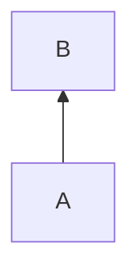

### Right → Left (`RL`)

**Syntax**

```text
graph RL
    A-->B
```

**Rendered**

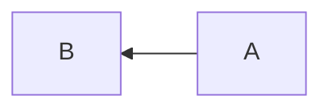

### Left → Right (`LR`)

**Syntax**

```text
graph LR
    A-->B
```

**Rendered**


### Top → Bottom (`TD`)

**Syntax**

```text
graph TD
    A-->B
```

**Rendered**


---

## 1.2 Nodes and Shapes

The original cheat sheet demonstrates the following node forms.

### Default Node

**Syntax**

```text
graph LR
    id
```

**Rendered**

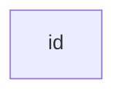

### Rectangle with Text

**Syntax**

```text
graph LR
    id1[This is the text in the box]
```

**Rendered**

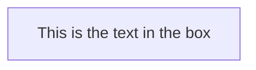

### Rounded Rectangle

**Syntax**

```text
graph LR
    id1(This is the text in the box)
```

**Rendered**

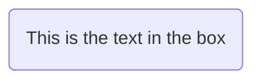

### Circle

**Syntax**

```text
graph LR
    id1((This is the text in the circle))
```

**Rendered**

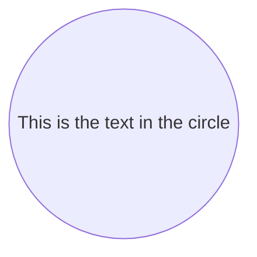

### Asymmetric / Flag Shape

**Syntax**

```text
graph LR
    id1>This is the text in the box]
```

**Rendered**

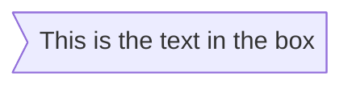

### Rhombus / Decision

**Syntax**

```text
graph LR
    id1{This is the text in the box}
```

**Rendered**

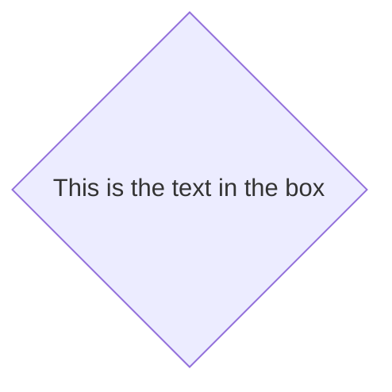

---

## 1.3 Links Between Nodes

### Link with Arrowhead

**Syntax**

```text
graph LR
    A-->B
```

**Rendered**


### Open Link

**Syntax**

```text
graph LR
    A---B
```

**Rendered**

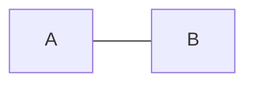

### Text on a Link

**Syntax**

```text
graph LR
    A-- This is the text ---B
```

**Rendered**

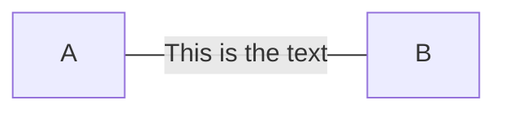

### Text on a Link with Pipe Syntax

**Syntax**

```text
graph LR
    A---|This is the text|B
```

**Rendered**


### Arrowhead with Text

**Syntax**

```text
graph LR
    A-->|text|B
```

**Rendered**

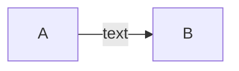

### Arrowhead with Inline Text

**Syntax**

```text
graph LR
    A-- text -->B
```

**Rendered**


### Dotted Link

**Syntax**

```text
graph LR
    A-.->B
```

**Rendered**

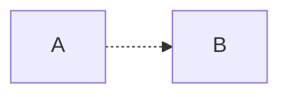

### Dotted Link with Text

**Syntax**

```text
graph LR
    A-. text .-> B
```

**Rendered**

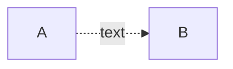

### Thick Link

**Syntax**

```text
graph LR
    A ==> B
```

**Rendered**

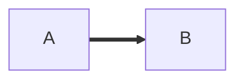

### Thick Link with Text

**Syntax**

```text
graph LR
    A == text ==> B
```

**Rendered**

```mermaid
graph LR
    A == text ==> B
```

---

## 1.4 Subgraphs

A `subgraph` groups related nodes together.

### Basic Syntax

**Syntax**

```text
subgraph title
    graph definition
end
```

**Rendered**

```mermaid
graph TB
    subgraph title
        A-->B
    end
```

### Multiple Subgraphs

**Syntax**

```text
graph TB
    c1-->a2

    subgraph one
        a1-->a2
    end

    subgraph two
        b1-->b2
    end

    subgraph three
        c1-->c2
    end
```

**Rendered**

```mermaid
graph TB
    c1-->a2

    subgraph one
        a1-->a2
    end

    subgraph two
        b1-->b2
    end

    subgraph three
        c1-->c2
    end
```

---

# 2. Sequence Diagrams

Sequence diagrams show how participants interact and the order in which those interactions occur.

## 2.1 Participants

Participants are rendered in the order in which they appear in the source.

### Explicit Participants

**Syntax**

```text
sequenceDiagram
    participant Alice
    participant John
    Alice->>John: Hello John, how are you?
    John-->>Alice: Great!
```

**Rendered**

```mermaid
sequenceDiagram
    participant Alice
    participant John
    Alice->>John: Hello John, how are you?
    John-->>Alice: Great!
```

### Control Participant Order

You can explicitly define participants in the order you want them displayed.

**Syntax**

```text
sequenceDiagram
    participant John
    participant Alice
    Alice->>John: Hello John, how are you?
    John-->>Alice: Great!
```

**Rendered**

```mermaid
sequenceDiagram
    participant John
    participant Alice
    Alice->>John: Hello John, how are you?
    John-->>Alice: Great!
```

### Implicit Participants

Participants can also be created automatically by using them in messages.

**Syntax**

```text
sequenceDiagram
    Alice->>John: Hello John, how are you?
    John-->>Alice: Great!
```

**Rendered**

```mermaid
sequenceDiagram
    Alice->>John: Hello John, how are you?
    John-->>Alice: Great!
```

---

## 2.2 Aliases

Use `as` to give a participant a short identifier and a descriptive label.

**Syntax**

```text
sequenceDiagram
    participant A as Alice
    participant J as John
    A->>J: Hello John, how are you?
    J-->>A: Great!
```

**Rendered**

```mermaid
sequenceDiagram
    participant A as Alice
    participant J as John
    A->>J: Hello John, how are you?
    J-->>A: Great!
```

---

## 2.3 Messages

The general message form is:

```text
[Actor][Arrow][Actor]:Message text
```

### Common Arrow Types

| Syntax | Meaning |
|---|---|
| `->` | Solid line without arrow |
| `-->` | Dotted line without arrow |
| `->>` | Solid line with arrowhead |
| `-->>` | Dotted line with arrowhead |
| `-x` | Solid line ending in a cross; asynchronous |
| `--x` | Dotted line ending in a cross; asynchronous |

### Message Examples

**Syntax**

```text
sequenceDiagram
    Alice->>John: Solid arrowhead
    John-->>Alice: Dotted arrowhead
    Alice->John: Solid line
    John-->Alice: Dotted line
    Alice-xJohn: Solid async
    John--xAlice: Dotted async
```

**Rendered**

```mermaid
sequenceDiagram
    Alice->>John: Solid arrowhead
    John-->>Alice: Dotted arrowhead
    Alice->John: Solid line
    John-->Alice: Dotted line
    Alice-xJohn: Solid async
    John--xAlice: Dotted async
```

---

## 2.4 Activations

An activation highlights the period during which an actor is active.

### Explicit Activation / Deactivation

**Syntax**

```text
sequenceDiagram
    Alice->>John: Hello John, how are you?
    activate John
    John-->>Alice: Great!
    deactivate John
```

**Rendered**

```mermaid
sequenceDiagram
    Alice->>John: Hello John, how are you?
    activate John
    John-->>Alice: Great!
    deactivate John
```

### Activation Shortcut

Append `+` to activate and `-` to deactivate.

**Syntax**

```text
sequenceDiagram
    Alice->>+John: Hello John, how are you?
    John-->>-Alice: Great!
```

**Rendered**

```mermaid
sequenceDiagram
    Alice->>+John: Hello John, how are you?
    John-->>-Alice: Great!
```

### Stacked Activations

Activations can be stacked for the same participant.

**Syntax**

```text
sequenceDiagram
    Alice->>+John: Hello John, how are you?
    Alice->>+John: John, can you hear me?
    John-->>-Alice: Hi Alice, I can hear you!
    John-->>-Alice: I feel great!
```

**Rendered**

```mermaid
sequenceDiagram
    Alice->>+John: Hello John, how are you?
    Alice->>+John: John, can you hear me?
    John-->>-Alice: Hi Alice, I can hear you!
    John-->>-Alice: I feel great!
```

---

## 2.5 Notes

Add notes with:

```text
Note [right of | left of | over] [Actor]: Text in note content
```

### Note to the Right

**Syntax**

```text
sequenceDiagram
    participant John
    Note right of John: Text in note
```

**Rendered**

```mermaid
sequenceDiagram
    participant John
    Note right of John: Text in note
```

### Note to the Left

**Syntax**

```text
sequenceDiagram
    participant John
    Note left of John: Text in note
```

**Rendered**

```mermaid
sequenceDiagram
    participant John
    Note left of John: Text in note
```

### Note Over a Participant

**Syntax**

```text
sequenceDiagram
    participant John
    Note over John: Text in note
```

**Rendered**

```mermaid
sequenceDiagram
    participant John
    Note over John: Text in note
```

### Note Over Two Participants

**Syntax**

```text
sequenceDiagram
    Alice->>John: Hello John, how are you?
    Note over Alice,John: A typical interaction
```

**Rendered**

```mermaid
sequenceDiagram
    Alice->>John: Hello John, how are you?
    Note over Alice,John: A typical interaction
```

---

## 2.6 Loops

Use `loop` to represent repeated behavior.

### Basic Syntax

```text
loop Loop text
    ... statements ...
end
```

### Example

**Syntax**

```text
sequenceDiagram
    Alice->John: Hello John, how are you?
    loop Every minute
        John-->Alice: Great!
    end
```

**Rendered**

```mermaid
sequenceDiagram
    Alice->John: Hello John, how are you?
    loop Every minute
        John-->Alice: Great!
    end
```

---

## 2.7 Alternatives and Optional Sections

### `alt` / `else`

Use `alt` for alternative paths.

**Syntax**

```text
alt Describing text
    ... statements ...
else
    ... statements ...
end
```

### `opt`

Use `opt` when a sequence is optional and has no `else` branch.

**Syntax**

```text
opt Describing text
    ... statements ...
end
```

### Combined Example

**Syntax**

```text
sequenceDiagram
    Alice->>John: Hello John, how are you?

    alt is sick
        John->>Alice: Not so good :(
    else is well
        John->>Alice: Feeling fresh like a daisy
    end

    opt Extra response
        John->>Alice: Thanks for asking
    end
```

**Rendered**

```mermaid
sequenceDiagram
    Alice->>John: Hello John, how are you?

    alt is sick
        John->>Alice: Not so good :(
    else is well
        John->>Alice: Feeling fresh like a daisy
    end

    opt Extra response
        John->>Alice: Thanks for asking
    end
```

---

# 3. Gantt Diagrams

A Gantt chart represents a project schedule using tasks, dates, durations, dependencies, and sections.

## Basic Gantt Chart

**Syntax**

```text
gantt
    title A Gantt Diagram
    dateFormat YYYY-MM-DD

    section Section
    First Task       :a1, 2018-07-01, 30d
    Another Task     :after a1, 20d

    section Another
    Second Task      :2018-07-12, 12d
    Third Task       :24d
```

**Rendered**

```mermaid
gantt
    title A Gantt Diagram
    dateFormat YYYY-MM-DD

    section Section
    First Task       :a1, 2018-07-01, 30d
    Another Task     :after a1, 20d

    section Another
    Second Task      :2018-07-12, 12d
    Third Task       :24d
```

## Gantt Task States

Useful task states include:

| State | Meaning |
|---|---|
| `done` | Completed |
| `active` | Currently active |
| `crit` | Critical task |
| `after ID` | Start after another task |
| `ID` | Assign an identifier |

### Larger Gantt Example

**Syntax**

```text
gantt
    dateFormat YYYY-MM-DD
    title Adding GANTT diagram functionality to mermaid

    section A section
    Completed task            :done, des1, 2018-01-06, 2018-01-08
    Active task               :active, des2, 2018-01-09, 3d
    Future task               :des3, after des2, 5d
    Future task2              :des4, after des3, 5d

    section Critical tasks
    Completed task in the critical line :crit, done, 2018-01-06, 24h
    Implement parser and jison          :crit, done, after des1, 2d
    Create tests for parser             :crit, active, 3d
    Future task in critical line        :crit, 5d
    Create tests for renderer           :2d
    Add to mermaid                      :1d

    section Documentation
    Describe gantt syntax               :active, a1, after des1, 3d
    Add gantt diagram to demo page      :after a1, 20h
    Add another diagram to demo page   :doc1, after a1, 48h

    section Last section
    Describe gantt syntax               :after doc1, 3d
    Add gantt diagram to demo page      :20h
    Add another diagram to demo page    :48h
```

**Rendered**

```mermaid
gantt
    dateFormat YYYY-MM-DD
    title Adding GANTT diagram functionality to mermaid

    section A section
    Completed task            :done, des1, 2018-01-06, 2018-01-08
    Active task               :active, des2, 2018-01-09, 3d
    Future task               :des3, after des2, 5d
    Future task2              :des4, after des3, 5d

    section Critical tasks
    Completed task in the critical line :crit, done, 2018-01-06, 24h
    Implement parser and jison          :crit, done, after des1, 2d
    Create tests for parser             :crit, active, 3d
    Future task in critical line        :crit, 5d
    Create tests for renderer           :2d
    Add to mermaid                      :1d

    section Documentation
    Describe gantt syntax               :active, a1, after des1, 3d
    Add gantt diagram to demo page      :after a1, 20h
    Add another diagram to demo page   :doc1, after a1, 48h

    section Last section
    Describe gantt syntax               :after doc1, 3d
    Add gantt diagram to demo page      :20h
    Add another diagram to demo page    :48h
```

---

# 4. Demos

These examples are adapted from the examples at the end of the original cheat sheet.

## 4.1 Basic Flowchart

**Syntax**

```text
graph LR
    A[Square Rect] -- Link text --> B((Circle))
    A --> C(Round Rect)
    B --> D{Rhombus}
    C --> D
```

**Rendered**

```mermaid
graph LR
    A[Square Rect] -- Link text --> B((Circle))
    A --> C(Round Rect)
    B --> D{Rhombus}
    C --> D
```

---

## 4.2 Flowchart with Decision

**Syntax**

```text
graph TD
    A[Christmas] -->|Get money| B(Go shopping)
    B --> C{Let me think}
    C -->|One| D[Laptop]
    C -->|Two| E[iPhone]
    C -->|Three| F[Car]
```

**Rendered**

```mermaid
graph TD
    A[Christmas] -->|Get money| B(Go shopping)
    B --> C{Let me think}
    C -->|One| D[Laptop]
    C -->|Two| E[iPhone]
    C -->|Three| F[Car]
```

> The original example uses Font Awesome syntax (`fa:fa-car Car`) for the final node. The simplified `Car` version above avoids requiring an external icon/font integration while keeping the diagram useful in a VS Code Markdown preview.

---

## 4.3 Larger Flowchart with Styling

This example combines:

- Subgraphs
- Multiple node shapes
- Edge labels
- Line breaks
- Comments
- Custom classes
- Custom node styling
- Unicode text

**Syntax**

```text
graph TB
    sq[Square shape] --> ci((Circle shape))

    subgraph A
        od>Odd shape]-- Two line<br/>edge comment --> ro
        di{Diamond with <br/> line break} -.-> ro(Rounded<br>square<br>shape)
        di==>ro2(Rounded square shape)
    end

    %% Notice that no text in shape are added here instead that is appended further down
    e --> od3>Really long text with linebreak<br/>in an Odd shape]

    %% Comments after double percent signs
    e((Inner / circle<br>and some odd <br>special characters)) --> f(,.?!+-*ز)

    cyr[Cyrillic]-->cyr2((Circle shape Начало));

    classDef green fill:#9f6,stroke:#333,stroke-width:2px
    classDef orange fill:#f96,stroke:#333,stroke-width:4px
    class sq,e green
    class di orange
```

**Rendered**

```mermaid
graph TB
    sq[Square shape] --> ci((Circle shape))

    subgraph A
        od>Odd shape]-- Two line<br/>edge comment --> ro
        di{Diamond with <br/> line break} -.-> ro(Rounded<br>square<br>shape)
        di==>ro2(Rounded square shape)
    end

    %% Notice that no text in shape are added here instead that is appended further down
    e --> od3>Really long text with linebreak<br/>in an Odd shape]

    %% Comments after double percent signs
    e((Inner / circle<br>and some odd <br>special characters)) --> f(,.?!+-*ز)

    cyr[Cyrillic]-->cyr2((Circle shape Начало));

    classDef green fill:#9f6,stroke:#333,stroke-width:2px
    classDef orange fill:#f96,stroke:#333,stroke-width:4px
    class sq,e green
    class di orange
```

---

## 4.4 Basic Sequence Diagram

This demonstrates several message styles and a note.

**Syntax**

```text
sequenceDiagram
    Alice ->> Bob: Hello Bob, how are you?
    Bob-->>John: How about you John?
    Bob--x Alice: I am good thanks!
    Bob-x John: I am good thanks!

    Note right of John: Bob thinks a long<br/>long time, so long<br/>that the text does<br/>not fit on a row.

    Bob-->Alice: Checking with John...
    Alice->John: Yes... John, how are you?
```

**Rendered**

```mermaid
sequenceDiagram
    Alice ->> Bob: Hello Bob, how are you?
    Bob-->>John: How about you John?
    Bob--x Alice: I am good thanks!
    Bob-x John: I am good thanks!

    Note right of John: Bob thinks a long<br/>long time, so long<br/>that the text does<br/>not fit on a row.

    Bob-->Alice: Checking with John...
    Alice->John: Yes... John, how are you?
```

---

## 4.5 Message to Self in a Loop

**Syntax**

```text
sequenceDiagram
    participant Alice
    participant Bob

    Alice->>John: Hello John, how are you?

    loop Healthcheck
        John->>John: Fight against hypochondria
    end

    Note right of John: Rational thoughts<br/>prevail...

    John-->>Alice: Great!
    John->>Bob: How about you?
    Bob-->>John: Jolly good!
```

**Rendered**

```mermaid
sequenceDiagram
    participant Alice
    participant Bob

    Alice->>John: Hello John, how are you?

    loop Healthcheck
        John->>John: Fight against hypochondria
    end

    Note right of John: Rational thoughts<br/>prevail...

    John-->>Alice: Great!
    John->>Bob: How about you?
    Bob-->>John: Jolly good!
```

---

# Quick Reference

## Flowchart Cheat Table

| Want | Syntax |
|---|---|
| Rectangle | `A[Text]` |
| Rounded rectangle | `A(Text)` |
| Circle | `A((Text))` |
| Diamond / decision | `A{Text}` |
| Asymmetric | `A>Text]` |
| Arrow | `A-->B` |
| Open line | `A---B` |
| Dotted arrow | `A-.->B` |
| Thick arrow | `A==>B` |
| Link label | `A-->|label|B` |
| Link label, alternate | `A-- label -->B` |
| Subgraph | `subgraph Name ... end` |
| Comment | `%% comment` |
| Custom class | `classDef name ...` |
| Apply class | `class A name` |

## Sequence Diagram Cheat Table

| Want | Syntax |
|---|---|
| Participant | `participant Alice` |
| Participant alias | `participant A as Alice` |
| Solid arrow | `Alice->>Bob: Message` |
| Dotted arrow | `Alice-->>Bob: Message` |
| Solid line | `Alice->Bob: Message` |
| Dotted line | `Alice-->Bob: Message` |
| Async solid | `Alice-xBob: Message` |
| Async dotted | `Alice--xBob: Message` |
| Activate | `activate Alice` |
| Deactivate | `deactivate Alice` |
| Activate shortcut | `Alice->>+Bob: Message` |
| Deactivate shortcut | `Bob-->>-Alice: Message` |
| Note right | `Note right of Alice: Text` |
| Note left | `Note left of Alice: Text` |
| Note over | `Note over Alice: Text` |
| Note over two | `Note over Alice,Bob: Text` |
| Loop | `loop Text ... end` |
| Alternative | `alt Text ... else ... end` |
| Optional | `opt Text ... end` |

## Gantt Cheat Table

| Want | Syntax |
|---|---|
| Start chart | `gantt` |
| Title | `title My Project` |
| Date format | `dateFormat YYYY-MM-DD` |
| Section | `section Section Name` |
| Basic task | `Task : 3d` |
| Task ID | `Task :id, 3d` |
| Start date | `Task : 2026-08-28, 3d` |
| Dependency | `Task :after taskId, 3d` |
| Completed | `Task :done, id, 3d` |
| Active | `Task :active, id, 3d` |
| Critical | `Task :crit, id, 3d` |

---

# VS Code Workflow

The most useful way to use this file is to keep the **syntax block and rendered block together**.

For example:

```text
graph LR
    A[Input] --> B[Process]
    B --> C[Output]
```

followed immediately by:

```mermaid
graph LR
    A[Input] --> B[Process]
    B --> C[Output]
```

When learning Mermaid:

1. Find an example close to what you want.
2. Edit the `text` syntax block.
3. Copy the changed Mermaid code into the `mermaid` block.
4. Open VS Code Markdown Preview with `Ctrl+Shift+V`.
5. Visually inspect the result.
6. Keep the finished Mermaid code in your research Markdown/Jupyter documentation.

This makes the document function as both a **syntax reference and a visual reference**.

---

## Source

Original tutorial:

[Mermaid Cheat Sheet — João Zhuang](https://jojozhuang.github.io/tutorial/mermaid-cheat-sheet/)

This cheat sheet reorganizes the tutorial's examples into Markdown/Mermaid pairs suitable for local VS Code preview.
